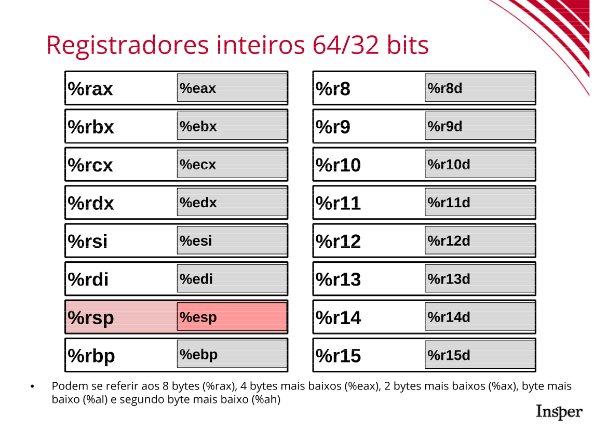
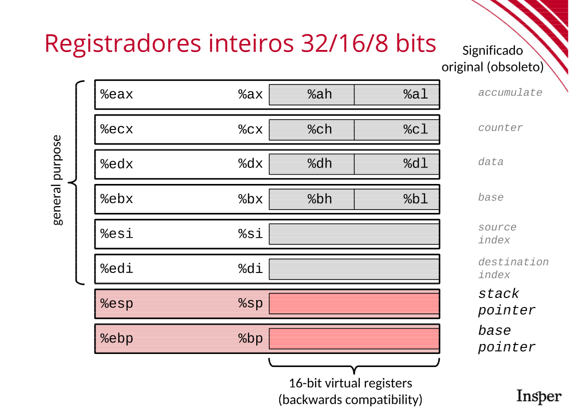

# 04 -  Funções

<!-- TOOD: ano que vem esse precisa de um exercício com correção automatizada. -->

Neste handout vamos trabalhar pela primeira vez na tradução reversa de programas em Assembly para *C*. Nas últimas aulas vimos as instruções `mov` e `add` e na aula de hoje vimos uma tabela grande com as instruções aritméticas (`add`, `sub`, `mul`, `imul`, `div`, etc).

Como em todas as aulas, veremos hoje um detalhe a mais sobre arquitetura *x64*: chamadas de funções e argumentos.

## Funções e seus argumentos

Em *x64* os argumentos das funções são passados nos registradores e o valor de retorno é colocado também em um registrador.

1. **Argumentos inteiros ou ponteiros** são passados nos registradores (**nesta ordem**):
    1. `%rdi`
    2. `%rsi`
    3. `%rdx`
    4. `%rcx`
    5. `%r8`
    6. `%r9`
1. **Argumentos ponto flutuante** são passados nos registradores `%xmm0` até `%xmm7`.
1. **Valores de retorno inteiros ou ponteiros** são colocados no registrador `%rax`.
1. **Valores de retorno ponto flutuante** são colocados no registrador `%xmm0`.

Para chamar funções usamos a instrução `call` seguido do endereço de memória da função. O `gdb` cria um "apelido" para estes endereços de memória usando o nome original da função no arquivo *.c*. Assim, estas instruções são mostradas, normalmente, como `call func1`, por exemplo. Note que antes de cada `call` devemos preencher os argumentos nos registradores corretos.

Para retornar usamos a instrução `ret`. Ela é equivalente ao comando `return` de *C* e devolverá o valor armazenado no `%rax` (ou `%xmm0` para ponto flutuante).






Não se esqueça da equivalência entre o tamanhos dos registradores e os tipos inteiros em *C*. Um resumo gráfico pode ser visto nas figuras acima.

1. **64 bits** (`%rax`, `%rdi` e outros que começam com `r`): `long`, `unsigned long` ou ponteiro;
1. **32 bits** (`%eax`, `%edi` e outros que começa com `e` e os que terminam em `d` como `r10d`): `int` ou `unsigned int`;
1. **16 bits** (`%ax`, `%di` e outros com duas letras somente terminando em `x`): `short` ou `unsigned short`
1. **8 bits** (`%al`, `%ah` e outros com duas letras terminando em `h` ou `l`): `char` ou `unsigned char`.

Vamos agora praticar fazendo a tradução de funções que fazem aritmética simples entre inteiros (usando ou não ponteiros). O exemplo abaixo mostra todas as etapas que precisamos seguir para fazer a tradução Assembly -> C.

## Exemplo guiado

Dado o código Assembly abaixo, faça sua tradução para *C*

```{asm}
0000000000000000 <misterio1>:
0:   48 01 f7                add    %rsi,%rdi
3:   48 8d 04 57             lea    (%rdi,%rdx,2),%rax
7:   c3                      retq
```

### Assinatura da função

Vamos começar pela assinatura da função. É sempre útil identificar quais registradores são lidos antes de serem escritos. Isso nos ajuda a entender se um registrador é um argumento da função ou se ele é apenas usado como variável local. Faremos isso escrevendo todos os registradores que podem ser argumentos em ordem e vendo se são lidos ou escritos primeiro:

* `%rdi` - lido primeiro (`add` faz a operação `+=`)
* `%rsi` - lido primeiro (no lado esquerdo do `add`)
* `%rdx` - lido primeiro (no lado esquerdo do `lea`)
* `%rcx` - não usado
* `%r8` - não usado
* `%r9` - não usado

Logo, os registradores `%rdi`, `%rsi` e `%rdx` são argumentos da função. Consultando o box de arquitetura de computadores, vemos que a função recebe três argumentos do tipo `long` (pois usa os registradores de 64 bits).

Note que o resultado das computações é guardado em `%rax`, que guarda sempre o retorno da função. Por usar a porção de 64 bits do registrador, o tipo de retorno também é `long`. A assinatura da função é, portanto

`long misterio1(long a, long b, long c);`

!!! tip
    Ponteiros também usam os registradores de 64 bits. Porém, olhando rapidamente o código notamos que não há nenhum acesso a memória. Logo, se trata realmente de `long`.

### O código

Vamos agora para o código. Nossa primeira estratégia é atribuir um nome para cada registrador. Os três registradores de argumentos já receberam os nomes `a`, `b` e `c`. Para deixar explícito o papel do `%rax` vamos nomeá-lo de `retval`.

A primeira instrução `add %rsi, %rdi` realiza a adição dos dois registradores e armazena em `%rdi`. Logo, sua tradução direta seria:

```c
a += b;
```

A instrução `lea (%rdi, %rdx, 2), %rax` é usada tanto para calcular endereços de memória quanto para aritmética simples. Vemos que é o segundo caso pois, no código seguinte, não acessamos a memória com o valor calculado. Logo, podemos traduzir este trecho como

```c
retval = a + 2 * c;
```

Logo após temos o `ret`, que é traduzido como

```c
return retval;
```

Logo, nossa função é traduzida como

```c
long misterio1(long a, long b, long c){
    long retval;
    a += b;
    retval = a + 2*c;
    return retval;
}
```

Finalmente, podemos deixar nosso código legível e escrevê-lo como

```c
long misterio1(long a, long b, long c){
    return a + b + 2*c;
}
```

Você pode verificar o código original no arquivo `exemplo1.c`.

--------------------

O processo acima pode ser formalizado no seguinte algoritmo:

1. Identifique quantos argumentos a função recebe
1. Identifique os tipos de cada argumento (pode ser necessário olhar o código assembly da função)
1. Dê um nome para cada registrador. Se um mesmo registrador é usado com tamanhos diferentes (`%rdi` e `%edi` são usados no código), dê um nome diferente para cada tamanho.
1. Faça a tradução de cada instrução separadamente.
1. Fique atento aos valores colocados em `%rax` e `%eax` perto do fim do código. Esses valores serão retornados pela função.
1. O código gerado costuma ser ilegível. Refatore-o para melhorar sua legibilidade.


!!! tip
    * A instrução `lea` pode ser usada tanto para aritmética quanto para cálculo de endereços. Para tirar a dúvida basta olhar se as próximas instruções fazem acesso à memória com o endereço calculado ou apenas usam o valor diretamente (aritmética).
    * Os registradores de tamanhos menores são virtuais. Quanto escrevo em `%ax` estou escrevendo nos 16 bits menos significativos de `%rax` e de `%eax` também.
    * Muitas instruções com operadores de 32bits zeram os 32bits superiores. Assim, vemos por exemplo a instrução `mov $0, %eax` sendo usada para zerar um `long`. Nesses casos é necessário verificar se a função continua usando `%eax` (é `int` mesmo) ou se ela magicamente passa a usar `%rax` (o tipo era `long`).

## Prática

Vamos agora exercitar. Cada exercício faz um cálculo diferente. Se houver alguma instrução desconhecida, pesquise-a no google para encontrar seu significado. Normalmente algo como "asm x64 instruction" + a instrução desconhecida dá respostas corretas.

!!! warning
    Usaremos o `gdb` para abrir os arquivos `.o` nesta aula. Este tipo de arquivo contém funções compiladas, mas não é um executável completo por não ter uma função `main`.

### Arquivo *ex1.o*

!!! exercise text long
    O código abaixo foi retirado do arquivo `ex1.o`. Faça sua tradução para *C*.

    ```{asm}
    0000000000000000 <ex1>:
    0:   89 f8                   mov    %edi,%eax
    2:   29 f0                   sub    %esi,%eax
    4:   c3                      retq
    ```

### Arquivo *ex2.o*

!!! exercise text long
    Use o `gdb` para listar as funções definidas em `ex2.o` e escreva-as abaixo.

!!! exercise text long
    Faça a tradução das funções acima para *C*

### Arquivo *ex3.o*

A função abaixo foi obtida de `ex3.o`.

```{asm}
0000000000000000 <ex3>:
0:   8b 06                   mov    (%rsi),%eax
2:   0f af c0                imul   %eax,%eax
5:   89 07                   mov    %eax,(%rdi)
7:   c3                      retq
```

!!! exercise text long
    O quê faz a instrução `imul`?

!!! exercise text long
    Traduza esta função para *C*. Fique atento ao tamanho dos registradores usados para identificar o tamanho dos variáveis inteiras.

-------------

Antes de prosseguir, valide suas soluções da seção anterior com o professor.

Vamos agora trabalhar com executáveis "completos". Vamos analisar não somente o código das funções mas também sua chamada.

### Arquivo *ex4*

!!! example
    Use o `gdb` para obter o conteúdo das funções `main` e `ex4`.

    **Dica**: lembre-se do comando `disas`

Localize a chamada da função `ex4` no main. As intruções acima do `call` colocam os argumentos nos lugares corretos para `ex4` rodar.

!!! exercise text long
    Quantos argumentos a função recebe? Quais são seus valores?

!!! exercise text long
    Traduza a função `ex4` para *C*.

### Arquivo *ex5* (desafio)

!!! warning
    Este exercício é avançado e necessita de pesquisa para ser realizado. Faça-o somente após validar suas soluções dos anteriores com os professores. A resposta dele será validada nos atendimentos.

Neste exercício vamos nos aprofundar no uso de ponteiros. Vimos no *ex3.o* um exemplo de função que armazenava um valor calculado em um ponteiro. Agora veremos um exemplo completo que inclui a chamada de uma função recebendo um endereço.

O trecho abaixo copia os argumentos para os registradores corretos e chama a função.

```{asm}
60b:   48 8d 4c 24 08          lea    0x8(%rsp),%rcx
610:   48 8d 54 24 0c          lea    0xc(%rsp),%rdx
615:   be 03 00 00 00          mov    $0x3,%esi
61a:   bf 0a 00 00 00          mov    $0xa,%edi
61f:   e8 d6 ff ff ff          callq  5fa <ex5>
```

!!! exercise text long
    Identifique a partir dos tipos de dados colocados nos registradores qual o tipo dos argumentos da função.

!!! exercise text long
    Qual são os endereços passados para a função `ex5`? Escreva-os em função do registrador `%rsp`.

!!! exercise text long
    Os endereços acima são passados em quais registradores?

Vamos agora ao código de `ex5`:

```{asm}
00000000000005fa <ex5>:
5fa:   89 f8                   mov    %edi,%eax
5fc:   48 89 d7                mov    %rdx,%rdi
5ff:   99                      cltd
600:   f7 fe                   idiv   %esi
602:   89 07                   mov    %eax,(%rdi)
604:   89 11                   mov    %edx,(%rcx)
606:   c3                      retq
```

!!! exercise text long
    Como a instrução `idiv` funciona? Em quais registradores ela posiciona seu resultado? Em quais registradores ela espera a entrada?

!!! exercise text long
    O quê faz a instrução `cltd`? Por quê ela é necessária?

!!! exercise text long
    Faça a tradução de `ex5` para *C*.

