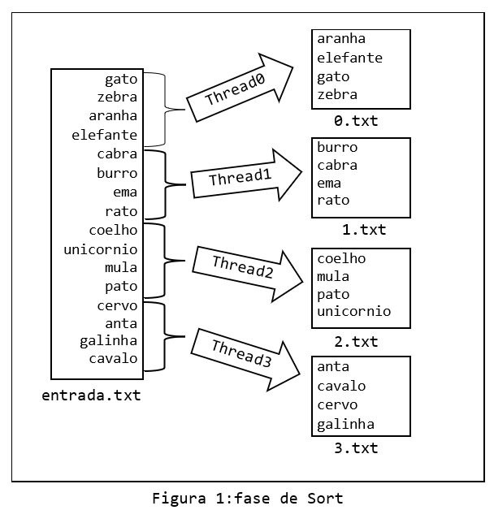
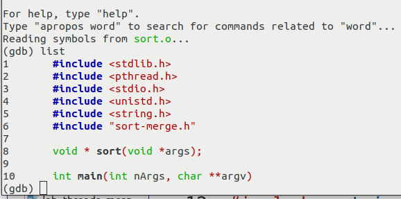

# Sort-Merge

## Introdução

No Laboratório de Threads, iremos implementar um algoritmo de ordenação de grandes volumes de dados utilizando Threads para obter um alto desempenho. O algoritmo, chamado **Sort-Merge** (ordenação-junção), é utilizado para ordenar dados em situações nas quais não é possível carregar todos os dados na memória do computador. No caso dos algoritmos de ordenação tradicionais, como InsertionSort ou BubbleSort, os dados são carregados na memória da máquina e ordenados.

O algoritmo Sort-Merge possui duas fases distintas, com cada fase consistindo em vários passos.

Na primeira fase, chamada **fase de Sort** (ordenação), os dados são divididos em partes que caibam na memória disponível, e são então ordenados e armazenados em arquivos temporários. Essa fase resulta na criação de um conjunto de arquivos temporários, cada um contendo partes (regiões) do arquivo original ordenados. A Figura 1 abaixo ilustra a **fase de Sort**.



Na segunda fase, denominada **fase de Merge** (junção), pares de arquivos temporários criados na fase anterior são lidos dos arquivos temporórios e ordenados, intercalando em ordem crescente os elementos lidos, de modo a resultar em um novo conjunto de arquivos temporários ordenados. Os itens de dois arquivos da etapa anterior são intercalados até que se obtenha um arquivo com todos os dados ordenados. A figura 2 abaixo ilustra a **fase de Merge**


## O que precisa ser feito

Sua tarefa é criar um programa que implemente o **algoritmo Sort-Merge** utilizando threads. Serão disponibilizados dois programas (**`sort.o`** e **`sort-merge.o`**) já compilados que auxiliarão no desenvolvimento da sua solução.

O programa **`sort.o`** contem a implementação da criação das threads para **fase de Sort**, veja a seguir:
```
int main(int nArgs, char **argv)
{   
    int nThreads, nItens;
    FILE *fp;
    if(nArgs != 4)
        return -1;
    
    nThreads = atoi(argv[1]);
    nItens   = atoi(argv[2]);

    fp = fopen(argv[3],"r");
    if( !fp ){
        printf("Erro ao abrir arquivo: %s\n",argv[3]);
        return -1;
    }
    printf("Serao criadas %d threads.\n",nThreads);
    fflush(stdout);
    
    pthread_t *tids = malloc(nThreads * sizeof(pthread_t));
    
    struct sort_args *vet_sort = malloc(nThreads * sizeof(struct sort_args));
    pthread_mutex_t mutex_file = PTHREAD_MUTEX_INITIALIZER;

    for (int i = 0; i < nThreads; i++) {
        vet_sort[i].idxThread = i;
        vet_sort[i].nThreads = nThreads;
        vet_sort[i].lineFiles = nItens;
        vet_sort[i].mutex_file = &mutex_file;
        vet_sort[i].fp = fp;
        pthread_create(&tids[i], NULL, sort, &vet_sort[i]);
        printf("Criou thread:%d fase sort\n", i);
    }
    
    printf("Funcao main() espera as threads sort finalizarem...\n");
    fflush(stdout);
    FILE **fpOut = malloc(nThreads*sizeof(FILE));
    for (int i = 0; i < nThreads; i++) {
        pthread_join(tids[i], (void**)&fpOut[i]);
        fclose(fpOut[i]);   
    }
    fclose(fp);
    free(vet_sort);
    free(tids);
    free(fpOut);
    printf("Funcao main() finalizando normalmente...\n");

    return 0;
}
```
Se quiser você pode ver o código fonte do programa  digite diretamente no terminal **`gdb sort.o`** e dentro do **`gdb`** digite **`list`** para listar o código fonte:



Você precisará implementar a função **`void * sort(void * args)`** que representa a thread responsável em ler concorrentemente o arquivo de entrada no arquivo **`solucao.c`**, esse arquivo conterá as soluções das **fase de Sort** e **fase de Sort-Merge**. Para compilar a sua solução use o comando:

```
$ gcc -g -Og -Wall sort.o solucao.c -o sort -pthread
```


Para executar o programa e testar sua solução, informe por linha de comando o número de threads (**`nThreads`**) que o programa deverá criar e o quantidade de itens (**`nItens`**) no arquivo que será ordenado e o nome do arquivo, por exemplo:

    
```
./sort nThreads nItens arqIn

./sort 4 16 in01.txt
```

Considere que quantidade de itens  dividido pela quantidade de  threads terá sempre um valor inteiro, ou seja, **`nItens %  nThreads  == 0`** e, além disso considere que  **`nItens`** e **`nThreads`** sempre serão potência de 2.

O programa **`sort-merge.o`** contem a implementação completa da criação das threads para **fase de Sort** e para **fase de Merge**, e após resolver a fase anterior você pode compilar esse programa junto com a sua solução no arquivo **`solucao.c`**. 


## Como começar?

Faça `git pull` no seu repositório de atividades e verifique na pasta lab se você recebeu os seguintes arquivos: 
- **`sort.o`** contem o código binário que cria as threads na **`fase de Sort`**. 
- **`sort-merge.o`** contem o código binário que cria as threads na **`fase de Sort`** e **`fase de Merge`**. 
- **`sort-merge.h`** arquivo com a declaração das estrutas e as funções usadas nas duas fases.
- **`in01.txt`** arquivo de teste para você começar a implementar as suas soluções.
- **`solucao.c`** programa fonte que deverá ser entrega com a sua implementação das threads nas fases  **`Sort`** e  **`Merge`**. 

## Avaliação

O programa será avaliado usando uma rubrica que descreve as duas fases implementadas. 

**Atenção:** Os testes automáticos serão nossa forma principal de avaliação. Entretanto, o professor poderá utilizar processos extras de avaliação, como: entrevistas, revisão manual de código.

## Como entregar as fases implementadas

Entregue cada versão utilizando o padrão já conhecido. Exemplo da versão `lab3.0.x`:

```
$ git tag -a lab3.0.55 -m "lab3.0.55"
$ git push origin lab3.0.55
```

### Tag `lab3.0.x`: fase Sort

Na fase de **Sort** cada thread deverá alocar um espaçao na memória para armazenar os itens de sua região, para tanto considere as seguintes observações:

* No arquivo de entrada cada item no arquivo de entrada será uma sequência de caracteres (por exemplo um nome de um animal), considere que os itens terão no máximo 20 caracteres (mas podem ter somente um caracteres) e cada um deles  estará armazenado em uma linha do arquivo, além disso podemos ter itens repetidos no arquivo.

* O arquivo de entrada será um recurso compartilhado que precisará tem seu acesso controlado, de forma que cada thread acesse o arquivo uma por vez. Além disso você também deve resolver como fazer com que a thread  faça a leitura correta de sua região no arquivo de entrada.

* Serão criadas nThreads (Thread 0, 1, ... n), informado por linha de linha de comando, e cada thread deve ler sua região no arquivo de entrada corretamente, ou seja, conforme exemplo da figura 1.

* Nessa fase você cada thread pode utilizar algoritmos tradicionais de ordenação (InsertionSort ou BubbleSort), para ordem ordenar sua porção do arquivo em memória.


* Nessa fase você cada thread pode utilizar algoritmos tradicionais de ordenação (InsertionSort ou BubbleSort), para ordem ordenar sua porção do arquivo em memória.


* Ao final da ordenação a thread deve escrever o seu resultado em um arquivo, a `Thread 0` cria e escreve no arquivo `0.txt`, a `Thread 1` cria e escreve no arquivo `1.txt` e assim por dianto. E por fim retorna para função principal (**`main()`**) o ponteiro (`FILE *`) do arquivo que foi criado para armazenar os seus itens ordenados.

**NOTA desta fase**: 6.0

### Tag `lab3.1.x`: fase Sort-Merge

para realizar essa fase você deverá ter finalizado a fase de **`Sort`**, pois esta fase tem como entrada os arquivos gerados na fase anterior (veja Figura 2). Por conta disso considere as seguintes observações:

* As threads nessa fase terão como entrada os ponteiros dos arquivos gerados na fase anterior. No programa   **`sort-merge.o`** poderá ver que os arquivos são passadas para as threads através de uma estrutura (`struct`).

* Cada thread receberá dois ponteiro de arquivos da fase anterior e fará o merge (intercalação) dos dois arquivos e gerando um terceiro arquivo que será retornado para a função principal (**`main()`**) que usará esse arquivo para próxima iteração.

* Note na função  (**`main()`**) que a cada iteração o número de threads será reduzida pela metada, até que reste somente uma thread e assim é finalizada o merge.

**NOTA desta versão**: 10.0

### Prazo 
[Clique Aqui](../../sobre)

